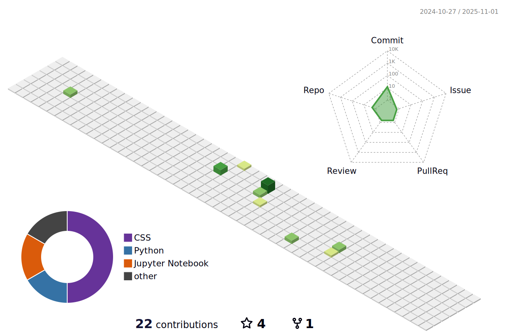

	<h1>Hi  My name is Nimish Garg</h1>
	<h3 style="margin: 0; line-height: 0.9;">Entrepreneur and Developer</h3>

<!-- <h2 style="margin: 0;">Crafting smart solutions for modern challenges</h2> -->

-   🔭 I’m currently working on **my startup, Market Mate, a data-driven marketing platform connecting wholesalers and retailers through personalized WhatsApp marketing.**

-   🌱 I’m currently learning **advanced Python, React, Automation Frameworks, advanced machine learning techniques and refining my skills in web automation with Selenium.**

-   👯 I’m looking to collaborate on **Automation projects, Web scraping, Problem-solving tools.**

-   🤝 I’m looking for help with **data extraction projects.**

-   👨‍💻 All of my projects are available at [https://github.com/Nimish05Z](https://github.com/Nimish05Z)

-   💬 Ask me about **entrepreneurship, automation, web scraping, or anything in programming.**

-   📫 How to reach me **nimishgrg05@gmail.com**

-   📄 Know about my experiences [https://www.linkedin.com/in/Nimish05Z](https://www.linkedin.com/in/Nimish05Z)

-   ⚡ **Avid Chess Player**

## 🏆 GitHub Trophies

# 📊 GitHub Stats:

	

		
    	
    

	

		
		
	

  

  

  
	
  

  <h3>🐍 My Contributions 🐍</h3>
  
   

###  Here's some humor for you:

<b>Top Repositories</b>

	
	

      

	
	

